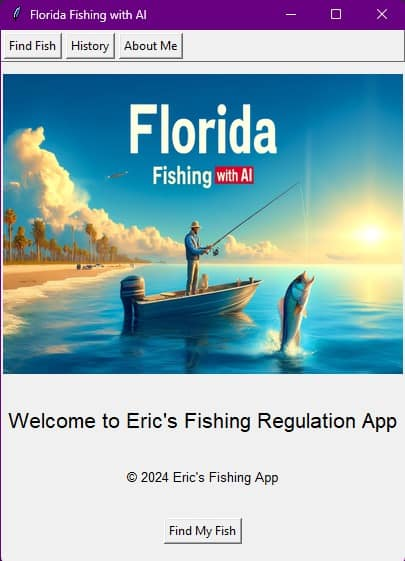

# Fishing Regulation Assistant

## Overview
The **Fishing Regulation Assistant** is a Python-based desktop application that helps users identify fish species using a custom-trained machine learning model and provides the corresponding fishing regulations. It integrates Azure Custom Vision for image classification and uses a graphical user interface built with Tkinter.



## Features
- 🐟 **Fish Species Identification**: Upload an image and get the top 3 species predictions using a trained model.
- 📜 **Fishing Regulations**: Automatically fetches and displays the regulations for the top predicted species.
- 🕓 **Search History**: Review all fish identifications during the session.
- 👤 **About Section**: View app details, author info, and supported fish species.


## Project Structure

```
finregai/
├── main.py
├── README.md
├── requirements.txt
├── assets/
│   ├── FishingAI.webp
│   ├── Florida_Fishing.webp
│   ├── Florida_Fishing.jpg
│   └── regulations.json
├── models/
│   └── label_encoder.pkl
├── app/
│   ├── __init__.py
│   ├── gui.py
│   ├── controller.py
│   ├── model.py
│   ├── regulations.py
│   └── utils.py
```

## Supported Fish Species
- Red Snapper
- Triggerfish (Gray)
- Permit
- Gag Grouper
- Barracuda
- Hogfish
- Mahi Mahi
- Lobster
- Billfish
- Tuna
- Lionfish

*More species will be added over time.*

## Technologies Used
- **Python**
- **Azure Custom Vision**
- `requests`, `opencv-python`, `tkinter`, `Pillow`, `matplotlib`, `numpy`, `json`

## Usage
1. Run `python main.py` to start the application.
2. Use **"Find My Fish"** to upload a fish image.
3. View predictions and regulations.
4. Explore **History** and **About Me** sections.

## Dataset and Model
The training dataset was curated by the author, Eric Ramirez. The ML model is hosted on Azure Custom Vision and is proprietary.

---

## Created by
**Eric Ramirez**  
_AI Engineer_

Licensed under the MIT License.